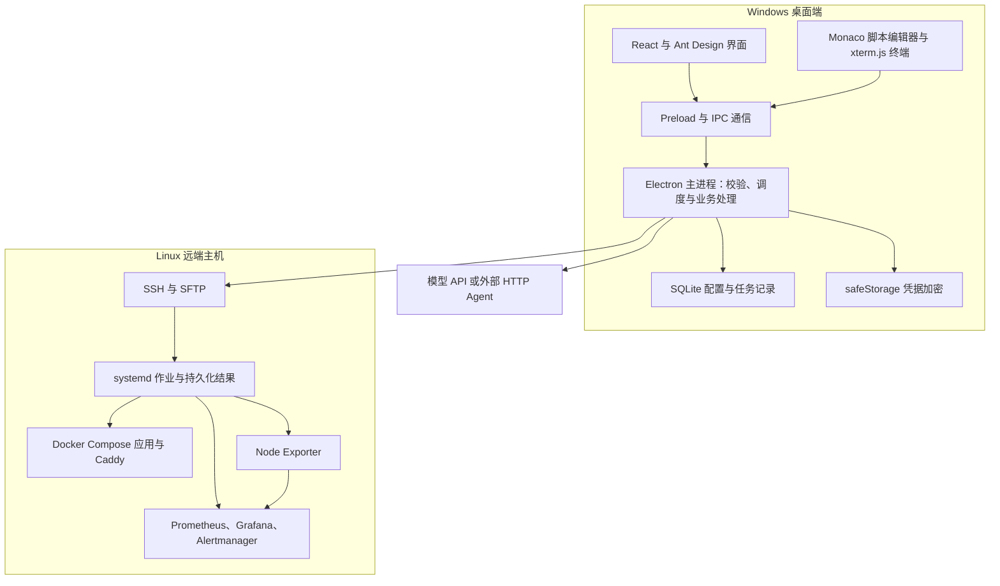

# 我做了一个 SRE 运维工作台：把 SSH、应用部署、监控告警和 AI 辅助放进桌面软件

管理 Linux 服务器时，很多工作本身并不复杂，却经常散落在不同工具里：用 SSH 登录主机，在终端查看日志，通过文件工具上传代码，再切换到监控页面确认服务状态。遇到重复操作，还要从历史记录中寻找上次执行过的命令。

我正在开发的 **SRE Workbench（SRE 运维工作台）**，就是想把这些日常操作放进一个中文桌面界面，让主机、脚本、部署方案和执行结果之间有明确的联系。

它采用 Windows 桌面端连接 Linux 服务器的方式，当前围绕主机管理、应用部署、监控告警、任务中心、脚本库和 AI 辅助展开。本文记录这一阶段的架构、功能，以及接下来准备怎样验证它。

项目源码已经公开：[GitHub · zhouzhouu07/sre-workbench](https://github.com/zhouzhouu07/sre-workbench)。

> 写于 2026 年 9 月 17 日。本文与这一轮修复代码一同提交，包含删除操作、执行反馈、监控表单、模型接口及 Rocky Linux 适配调整。源码更新与安装包发布分别进行，GitHub 上较早发布的安装包不一定包含全部调整，实际下载请查看对应版本说明。

## 一、项目要解决什么问题

这个项目主要面向个人运维、开发测试环境，以及少量 Linux 主机的日常管理。目前的重点是把几条常见流程做好：连接主机、检查状态、执行脚本、发布应用，再通过监控确认结果。

例如，部署一个 Node.js 服务时，希望能够在同一个工具里完成：

1. 选择已经保存的目标主机。
2. 选择本地源码或 Git 仓库，填写构建和启动参数。
3. 查看即将执行的部署脚本，确认后提交。
4. 跟踪执行状态、日志和退出码。
5. 查看发布版本，必要时回退。

这些步骤需要共享主机信息、部署配置和任务记录。把它们放在同一套数据与执行流程中，可以减少重复填写，也便于追查某次操作究竟执行到了哪里。

## 二、整体架构：桌面端管理，Linux 远端执行

整个系统可以分成三部分：界面层、本地主进程和远端 Linux 环境。



### 界面负责交互，主进程负责实际操作

桌面外壳使用 Electron，界面使用 React、TypeScript 和 Ant Design。脚本编辑由 Monaco Editor 提供，交互式终端使用 xterm.js。

界面通过 Preload 暴露的接口向主进程发送请求。SSH 连接、数据库写入、凭据读取和模型请求，都由主进程处理。渲染进程关闭 Node.js 集成，并启用上下文隔离和沙箱；主进程还会检查 IPC 请求来源和参数。

这样划分后，页面主要处理表单和结果展示，具体的运维逻辑集中在后端服务中。例如，删除按钮只是发出请求，能否删除仍由主进程根据任务状态和关联关系判断。

### 本地保存管理数据，服务器保存运行结果

主机配置、脚本版本、部署方案和任务历史保存在本地 SQLite 中，数据库通过 sql.js 使用。密码、私钥和 API Key 等凭据经 Electron safeStorage 加密后保存，普通配置通过引用关联凭据。

这里需要区分两种数据：本地数据库记录工作台掌握的配置和状态，远端主机则保存实际作业日志、退出码、容器和业务数据。桌面端重新连接后，可以据此核实执行结果。

凭据加密并不等于整个数据库都已加密，脚本和日志也可能包含用户自行写入的敏感内容，因此本地数据库仍应按运维资料妥善保管。

### 远端以 SSH、systemd 和容器为基础

工作台通过 `ssh2` 建立 SSH、SFTP 和终端连接。主机管理与任务执行不依赖额外开发的常驻管理 Agent；需要监控时，才会部署 Node Exporter 等组件。

长任务由远端 systemd 单元承载。源码上传和资源准备阶段仍依赖桌面端，但远端作业提交后，执行便不再依赖某个交互式终端持续保持打开。

## 三、目前有哪些功能

| 模块 | 主要能力 |
| --- | --- |
| 主机管理 | 保存 SSH 连接、核实指纹、查看资源与进程、管理服务和容器、终端与 SFTP |
| 应用部署 | 本地或 Git 源码、部署模板、环境变量、目录映射、健康检查、发布记录与回退 |
| 监控告警 | 部署采集与监控组件、配置阈值、邮件与 Webhook、测试告警和静默 |
| 任务中心 | 查看状态、执行步骤、日志和退出码，取消任务或核实不确定结果 |
| 脚本库 | 编辑脚本、保存历史版本、选择主机执行、删除保存版本 |
| AI 助手与设置 | 接入模型或外部 Agent，分析上下文、生成脚本草稿、测试 API 连接 |

### 主机管理：把常用检查放到一起

主机支持密码或私钥认证，可以配置分组、标签及 sudo 凭据。首次建立可信连接前，需要核对 SSH 公钥指纹；后续指纹变化时，连接会被拒绝，避免未经核实连接到另一台机器。

进入主机管理后，可以查看负载、内存、磁盘、进程、systemd 服务和日志，也可以查看 Docker 容器。终端用于临时排查，SFTP 用于文件浏览和传输。

### 应用部署：从源码到服务入口

当前支持前端静态站点、Node.js、Python 和已有 Dockerfile 的项目。源码可以来自本地目录，也可以来自 HTTPS Git 仓库。

部署方案保存安装命令、构建命令、启动命令、端口、健康检查路径、环境变量和持久化目录。对于模板项目，工作台生成 Dockerfile、Compose 和 Caddy 配置，再上传到 Linux 端构建运行。

一轮部署大致经过：

```text
环境与端口预检
    → 准备、上传源码和配置
    → 构建镜像
    → 启动候选版本
    → 健康检查
    → 切换 Caddy 入口
    → 记录发布结果
```

候选版本通过健康检查后才切换入口。发布记录用于查询和回退，当前保留最近三个成功版本。域名模式通过 Caddy 提供 HTTPS 能力，实际证书签发仍取决于 DNS、端口及网络条件。

这里没有把所有更新都描述成“无感发布”：带业务目录映射的应用，会先停止旧版以避免两个版本同时写入同一目录，因此可能短暂停机。版本回退也只处理应用镜像和入口，不会回退数据库及持久化文件。

### 监控告警：让服务状态有持续反馈

监控部分由四个组件配合完成：

| 组件 | 在项目中的职责 |
| --- | --- |
| Node Exporter | 暴露 Linux 主机指标 |
| Prometheus | 采集指标并评估告警规则 |
| Grafana | 展示主机资源看板 |
| Alertmanager | 对告警分组、静默，并发送通知 |

工作台负责生成配置并部署这些组件。初始规则覆盖主机不可达、CPU、内存和磁盘使用率，阈值及持续时间可以调整。

邮件配置提供服务商预设，常用信息集中为发件邮箱、授权码和收件邮箱；自定义 SMTP、分组时间和 Webhook 放在高级设置中。测试通知会向 Alertmanager 提交测试告警，邮件是否送达还需要查看邮箱及通知链路。

Grafana 等管理端口绑定远端回环地址，工作台通过 SSH 隧道打开管理页面。关闭桌面软件后，隧道结束，已部署在服务器上的采集、规则计算和通知服务继续运行。

## 四、任务中心：不能把“断线”直接当成“失败”

任务执行是这个项目中比较重要的一层。远程运维很容易遇到一种情况：SSH 已经断开，但服务器上的命令可能还在运行。此时直接重试，可能造成重复部署或重复修改。

工作台使用排队、运行中、成功、失败、已取消和状态待核实等状态。同一主机上的任务串行调度，全局最多同时处理三个主机的任务。

远端脚本通过包装程序保存输出和退出码，本地再读取结果。遇到无法确定的提交或连接状态，任务会进入“状态待核实”，由用户重新核实，避免自动重复执行。

最近还补齐了执行后的反馈。脚本、应用和监控部署提交后，会打开结果面板，显示关联任务、执行步骤、日志和最终退出码；关闭面板后，记录仍可在任务中心查看。

已结束的任务可以删除本地记录。正在执行、等待核实、仍在收尾，或者被后续监控任务依赖的记录，则会阻止删除，以免破坏正在进行的工作。

## 五、AI 辅助：分析和生成草稿，执行仍需确认

AI 助手目前有两种接入方式：兼容模型 API，以及项目定义的外部 HTTP Agent 接口。

使用时，用户填写问题并提供需要分析的上下文。发送前先预览内容，确认后再提交。服务返回分析摘要和结构化脚本草稿，脚本可以继续编辑、保存到脚本库，然后选择主机执行。

这里有两个独立确认点：确认把哪些内容发给模型，以及确认在目标主机执行哪段脚本。模型返回脚本本身不会触发远端执行，外部 Agent 也不会因此获得 SSH 凭据。

当前本地版本支持 OpenAI 与 Anthropic 兼容协议，并可自动识别常见地址。比如 DeepSeek 的 Anthropic 基础地址是：

```text
https://api.deepseek.com/anthropic
```

处理这类接口时，需要同时适配请求路径、认证头、消息结构和响应解析。最近的修复正是补齐了这一层，而不只是更换 URL 字符串。设置页面也增加了连接测试，使用固定短句检查接口，不发送主机日志。

## 六、这轮优化主要补了哪些问题

最近这一阶段先集中处理已有流程的可用性。

首先是列表管理。应用部署、监控方案、任务记录和脚本版本补上了删除入口及后端处理。删除方案只清理本地配置和相关记录，不会卸载远端服务；界面会明确说明，避免把“删除管理记录”误认为“停止服务器上的应用”。

其次是表单反馈。监控方案缺少采集目标时，界面会直接提示需要添加主机；后端参数错误也转换成可读的字段提示，避免整段校验 JSON 反复弹出。

另外，部署流程补充了 Rocky Linux 9.4 x86_64 的适配，包括 DNF 安装路径和容器配置目录的 SELinux 标签处理。检测到冲突的现有运行时包时会停止并提示，不自动移除；SELinux 和防火墙策略也不会被直接关闭。

这些改动已经进入本地版本，真实 Rocky 环境下的部署效果还要在下一阶段验证。

## 七、代码如何组织

仓库按照界面、核心能力和业务功能划分：

```text
src/
├── main/
│   ├── core/        # 数据存储、SSH、任务调度、校验与执行确认
│   ├── features/    # 应用部署、监控、源码处理、模型与 Agent 接口
│   ├── index.ts     # Electron 主进程入口及 IPC 分发
│   └── preload.ts   # 界面访问主进程的桥接接口
├── renderer/
│   ├── pages/       # 主机、部署、监控、任务、脚本及 AI 页面
│   └── components/  # 终端、编辑器、执行确认与结果展示
└── shared/          # 共享类型及表单校验逻辑

tests/               # 核心逻辑、HTTP 协议、脚本与界面测试
examples/            # 示例应用和外部 Agent 示例
docs/                # 使用说明与接口文档
```

核心层提供连接、存储和任务能力；业务层把这些能力组合成部署与监控流程；界面层负责收集参数和展示结果。后续增加功能时，可以尽量复用已有的执行确认、任务记录和日志反馈，不必再单独实现一套执行通道。

## 八、当前验证到了哪一步

截至本次本地修复完成，验证情况如下：

| 验证内容 | 当前结果 |
| --- | --- |
| 自动化测试 | 75 项通过，覆盖核心逻辑、删除约束、HTTP 协议、监控配置和部署脚本分支等 |
| Electron 界面回归 | 3 项通过，覆盖基本交互、执行反馈、删除操作及监控表单 |
| TypeScript 类型检查 | 通过 |
| 生产构建与 Windows 安装包生成 | 完成 |
| 打包程序检查 | 已验证启动、本地数据库读写和脚本删除 |
| 真实 Rocky Linux 9.4 部署 | 待虚拟机环境验证 |
| 真实模型 API、邮件送达与完整监控链路 | 待实际凭据和网络环境联调 |

这些测试能检查代码行为，但目前的系统命令测试使用受控替身，模型协议测试使用本地 HTTP 服务。它们不能替代真实服务器上的镜像拉取、服务启动、权限、网络和邮件投递测试。

接下来，我会准备 Rocky Linux 9.4 虚拟机，先把现有功能完整跑一遍：连接及 sudo、脚本执行、应用部署和回退、指标采集、邮件通知，以及断线后的状态核实。等这些流程稳定后，再根据实际使用反馈确定新增功能的优先级。

## 九、项目地址与运行方式

源码和项目进展可以在这里查看：

- [GitHub 仓库：zhouzhouu07/sre-workbench](https://github.com/zhouzhouu07/sre-workbench)
- [Releases：查看已发布版本及附件](https://github.com/zhouzhouu07/sre-workbench/releases)
- [Issues：反馈问题与需求](https://github.com/zhouzhouu07/sre-workbench/issues)

源码开发环境建议使用 Windows x64、Node.js 24 和 pnpm 11：

```powershell
git clone https://github.com/zhouzhouu07/sre-workbench.git
cd sre-workbench
pnpm install --frozen-lockfile
pnpm prepare:git
pnpm dev
```

本地验证与打包命令：

```powershell
pnpm typecheck
pnpm test
pnpm build
pnpm test:e2e
pnpm package
```

运行已经打包的桌面程序不需要额外安装本地 Node.js 或 Python，源码开发才需要上述环境。Linux 端则需要具备 SSH、systemd、相应权限，以及访问软件源和镜像仓库的网络条件。

如果你也在管理自己的 Linux 测试环境，欢迎查看仓库或通过 Issues 交流。接下来我会继续记录虚拟机测试中发现的问题，以及这些问题怎样推动工作台逐步完善。
